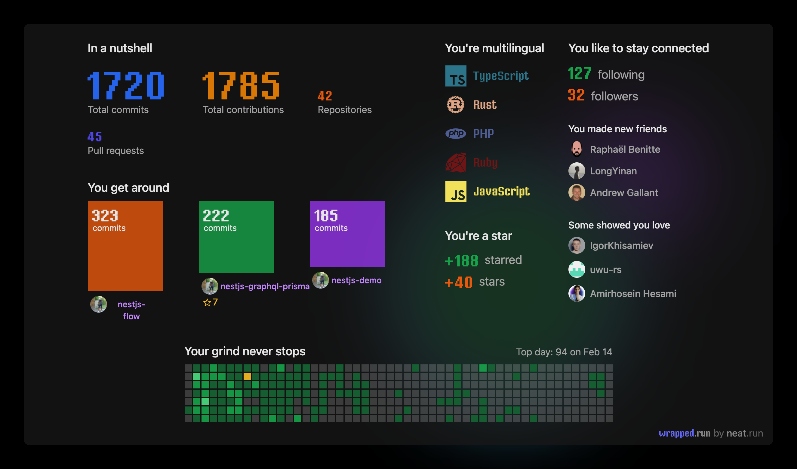

### Tien Duy NGUYEN - @tienduy-nguyen
---

Hi, I'm Duy.

Thanks for checking my profile!

- 🔭 I’m currently working NodeJS/TypeScript, Backend architecture, CI-CD, TDD, BDD
- 🌱 I’m currently learning Devops, Rust

---

---
<!--
**tienduy-nguyen/tienduy-nguyen** is a ✨ _special_ ✨ repository because its `README.md` (this file) appears on your GitHub profile.

Here are some ideas to get you started:

- 🔭 I’m currently working on ...
- 🌱 I’m currently learning ...
- 👯 I’m looking to collaborate on ...
- 🤔 I’m looking for help with ...
- 💬 Ask me about ...
- 📫 How to reach me: ...
- 😄 Pronouns: ...
- ⚡ Fun fact: ...
-->
